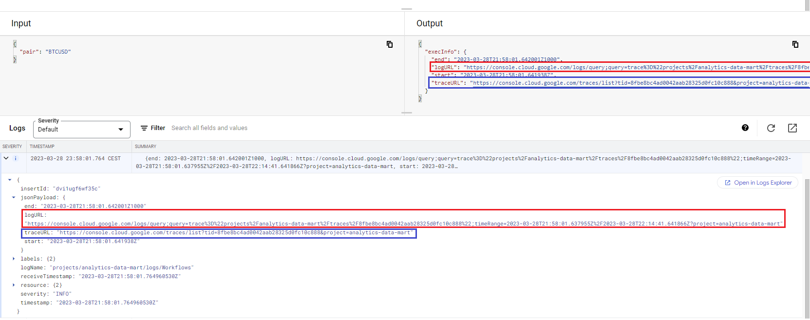
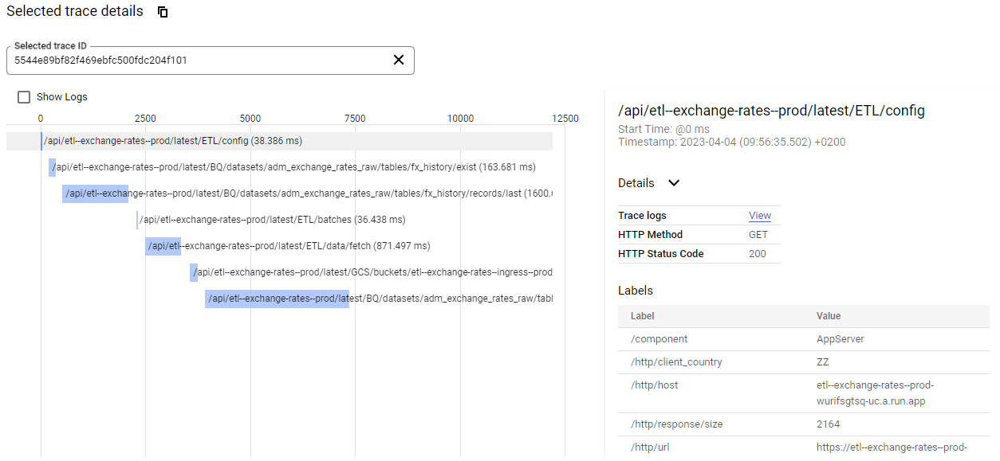
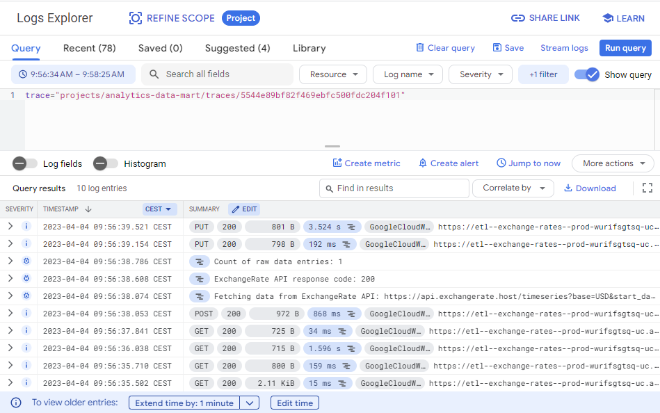

# Introduction

This project establishes data pipeline which sources data from Exchange Rates host documented on [https://exchangerate.host/#/#docs](https://exchangerate.host/#/#docs) into Analytics Data Mart. At this moment we are sourcing on daily basis exchange rates only for these currencies:

* EUR
* USD

If you are keen to understand more about:

* ETL process, click here: [ETL](etl.md).
* used GCP infrastructure, see: [Infrastructure](infra.md).

## Features

The current implementation of the data pipeline has the following features:

* Storing data in BigQuery dataset
* Steering the data pipeline via Google Cloud Workflows
* Tracing the data pipeline via Google Cloud Trace
* Logging the data pipeline via Google Cloud Logging
* Failure alerting for the data pipeline via Google Cloud Monitoring > Alerting
* Deployment of multiple environments (DEV/PROD/...)
* Fully automated via Cloud Scheduler

### BigQuery data

All the data are stored in the separate BigQuery dataset: [{{ pattern("bigquery.datasets.raw")}}](https://console.cloud.google.com/bigquery?project={{ conf.env.PROD.id }}&ws=!1m4!1m3!3m2!1s{{ conf.env.PROD.id }}!2s{{ pattern("bigquery.datasets.raw")}}) within the Google Cloud project: `{{ conf.env.PROD.id }}`. 

At this moment all the currency pairs are stored within one table `{{ pattern("bigquery.datasets.raw")}}.fx` with the following schema:

{{ grid_schema("../config/subjects/fx.BQ-table.yaml") }}

### Managed workflows

The Google Cloud Workflow is used to orchestrate the ETL process. The workflows related to this project can be found [https://console.cloud.google.com/workflows?project={{ conf.env.PROD.id }}](https://console.cloud.google.com/workflows?project={{ conf.env.PROD.id }}) with prefix `etl--{{ conf.solution.code }}`. There are 3 workflows:

* `{{ pattern("workflows.etl")}}` - main workflow which get list of currency pairs and runs the `{{ pattern("workflows.wrapper")}}` workflow for each of them
* `{{ pattern("workflows.wrapper")}}` - workflow which is responsible for running the `{{ pattern("workflows.subject")}}` within logging wrapper
* `{{ pattern("workflows.subject")}}` - core workflow for sourcing data from Binance API to BigQuery


### Tracing

The Google Cloud Trace is used to trace the execution of the workflows. The second log entry for each execution of the `{{ pattern("workflows.wrapper")}}` contains information with direct link to the trace. Following image show you where in the logs or outputs (only if the execution is successfully) can be found the trace link:



The <span style="color:blue">blue shapes</span> show the trace link in the logs and the <span style="color:red">red shapes</span> shows the direct links to the GCP logs.


```json
{
  "execInfo": {
    "end": "2023-04-04T07:56:34.959080Z1000",
    "executionURL": "https://console.cloud.google.com/workflows/workflow/us-central1/etl--exchange-rates--wrapper--prod/execution/5544e89b-f82f-469e-bfc5-00fdc204f101?project=analytics-data-mart",
    "logURL": "https://console.cloud.google.com/logs/query;query=trace%3D%22projects%2Fanalytics-data-mart%2Ftraces%2F5544e89bf82f469ebfc500fdc204f101%22;timeRange=2023-04-04T07:56:34.959010Z%2F2023-04-04T07:58:25.223742Z?project=analytics-data-mart",
    "start": "2023-04-04T07:56:34.959010Z",
    "traceURL": "https://console.cloud.google.com/traces/list?tid=5544e89bf82f469ebfc500fdc204f101&project=analytics-data-mart"
  }
}
```

where the direct link to the traces in the `traceURL` field.

The trace chart for the workflow execution looks like this:



### Logging

The logging of the workflows is done via Google Cloud Logging. For each of the execution of the ETL subject we join the logs with the help of the TraceID.
All the logs for the Cloud Run service executions manged by Cloud Workflows can be filter out with help of following expression:

```text
resource.type = "cloud_run_revision"
resource.labels.service_name = "{{ pattern("run.services.runner")}}"
resource.labels.location = "{{ conf.env.PROD.region }}"
severity>=DEFAULT
```

or directly with the traceID obtained from the logs (for example:

```text
trace="projects/YOUR-PROJECT-ID/traces/8fbe8bc4ad0042aab28325d0fc10c888"
```



### Multi-environment deployment

The environment of the deployment is controlled with the help of configuration files within the `config` directory. The configuration files are:

```bash
/ root
├── config  
│   ├── config.cloud.google.env.DEV.json      # project specification in Google Cloud Platform for DEV environment
│   ├── config.cloud.google.env.PROD.json     # project specification in Google Cloud Platform for PROD environment
│   ├── config.cloud.google.env.TEST.json     # project specification in Google Cloud Platform for TEST environment
```

The GCP projects can be the same for all the environment or different the important think is the specification needs to contain `env` key:

```json
{
  "GCP": {
    "id": "your-project-id",
    "name": "your-project-name",
    "number": 123456789123,
    "location": "US",
    "region": "us-central1",
    "zone": "us-central1-b",
    "env": "prod"                 # environment name
  }
}
```

### Fully automated solution

The execution of the ETL workflows is fully automated via Google Cloud Scheduler. The scheduler has the name [`{{ pattern("scheduler.etl")}}`](https://console.cloud.google.com/cloudscheduler/jobs/edit/{{ conf.env.PROD.region }}/{{ pattern("scheduler.etl")}}?project={{ conf.env.PROD.id }}) and is configured to run `{{ conf.services.scheduler.etl.schedule }}`
